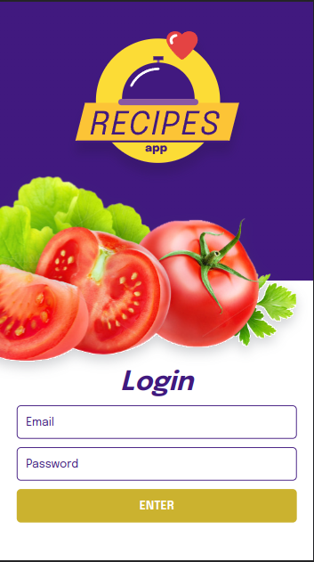
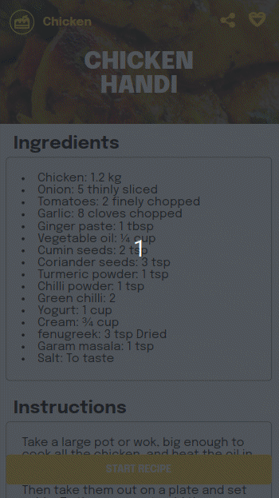
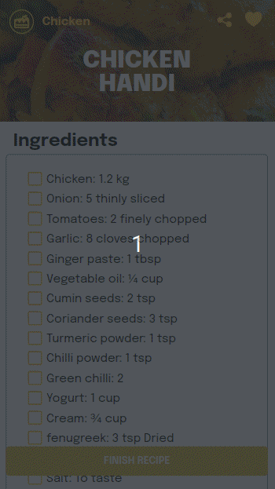
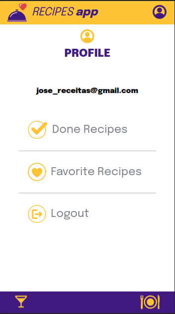
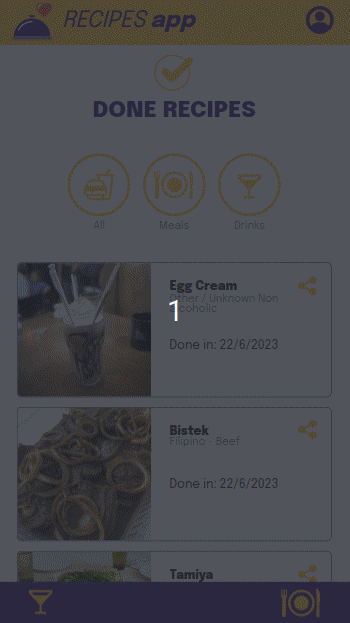
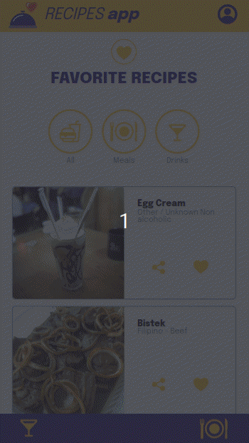

# 🎉 Bem vindo ao repositório do App de Receitas 🥘

  

  
Índice 📑 

  <ol>
    <li>
      <a href="#sobre-o-projeto">Sobre o Projeto</a>
      <ul>
        <li><a href="#construido-com">Construido Com</a></li>
      </ul>
    </li>
    <li>
      <a href="#começando">Começando</a>
      <ul>
        <li><a href="#instalação">Instalação</a></li>
        <li><a href="#executando">Executando</a></li>
      </ul>
    </li>
    <li><a href="#uso">Uso</a></li>
    <li><a href="#contato">Contato</a></li>
    <li><a href="#agradecimentos">Agradecimentos</a></li>
  </ol>

## Sobre o Projeto
Foi desenvolvido em grupo, com objetivo de treinar as soft skills, metodologias ágeis e revisar as hard skills, uma aplicação de busca de receitas utilizando React.js no paradigma funcional e realizando testes automatizados para garantir a qualidade.

Neste app a pessoa usuária pode pesquisar por receitas de comidas ou bebidas, podendo fazer uma busca por nome da receita, primeira letra e ingredientes que ela utiliza ou selecionar uma categoria. Ao encontrar a receita desejada a pessoa usuária pode ver os detalhes da receita ao clicar sobre o card da receita, na página de detalhes da receita é possível favoritar a receita, compartilhá, e iniciar a receita clicando sobre o botão START RECIPE. Ao iniciar a receita o usuário poderá checar os ingredientes, após checar os ingredientes e clicar no botão FINISH RECIPE será redirecionado para página de receitas feitas.

[Este](https://www.figma.com/file/g583ReaScBdevPmylIeDcp/%5BProjeto%5D%5BFrontend%5D-Recipes-App-(Copy)?type=design&node-id=0%3A1&t=Tjs8coUvioSRyYqp-1) foi o protótipo no Figma utilizado no desenvolvimento.
> O layout tem como foco dispositivos móveis, dessa forma todos os protótipos vão estar desenvolvidos em telas menores.

A base de dados são duas APIs distintas, uma de comida e outra de bebida.
* API de comida [TheMealDB](https://www.themealdb.com/)
* API de bebida [TheCocktailDB](https://www.thecocktaildb.com/)

### Habilidades trabalhadas
* Comunicação
* Colaboração
* Pair programming
* Metodologias ágeis
* Atomic design
* Desenvolvimento orientado a testes
* Context API
* React hooks

### Construido Com

  * 
  * 
  * 
  * 
  * 
  * 
  * 
 

(<a href="#readme-top">voltar ao topo</a>)

## Começando

### Instalação

1. Clonar o repositorio

        git clone git@github.com:RenanFernandess/trybe-project-recipes-app.git

2. Entrar na pasta project-recipes-app
  
        cd ./trybe-project-recipes-app
    
3. Instalar pacotes NPM
  
        npm install

### Executando
  
1. iniciar o aplicativo
    
        npm start

   após o start por padrão você será redirecionado para uma página do seu navegador com a seguinte URL:
   
        http://localhost:3000/

(<a href="#readme-top">voltar ao topo</a>)

 
## Uso

<table>
  <tr>
    <td width="50%">
      

        <h3>Tela de Login</h3>
        
        
Tela de login simulada você pode digitar um email e senha fictícios para fazer o login, o botão ENTER fica inicialmente desativado, para ele ativar é nescessario digitar o email e uma senha com no minimo 6 caracteres.

      

    </td>
    <td width="50%">
      

        <h3>Tela de Comidas 🥘</h3>
        
        
Na página Meals é onde você vai buscar as receitas de comidas, ao clicar sobre o ícone de lupa vai mostrar a barra de pesquisa, onde você pode fazer uma busca por nome da receita, pela primeira letra ou um ingrediente que ela utiliza. Você também pode fazer uma busca por categoria ao clicar sobre alguma das categorias listadas.

      

    </td>
  </tr>
  <tr>
    <td>
      

        <h3>Tela de Bebidas 🍹</h3>
        
        
Na página Drinks é onde você vai buscar as receitas de bebidas, ao clicar sobre o ícone de lupa vai mostrar a barra de pesquisa, onde você pode fazer uma busca por nome da receita, pela primeira letra ou um ingrediente que ela utiliza. Você também pode fazer uma busca por categoria ao clicar sobre alguma das categorias listadas.

      

    </td>
    <td>
      

        <h3>Tela de Detalhes da Receita 🗒️</h3>
        
        
Na tela de detalhes da receita, você pode adicionar aos favoritos ao clicar sobre ícone de coração, também pode copiar o link da receita ao clicar sobre o ícone de compartilhar. Nesta página você encontrará os ingredientes, instruções, um vídeo da receita e recomendações de bebidas. Para iniciar o preparo da receita basta clicar no botão START RECIPE.

      

    </td>
  </tr>
  <tr>
    <td>
      

        <h3>Tela de Receita em Progresso 🧑‍🍳</h3>
        
        
Na tela de receita em progresso, você pode adicionar aos favoritos e copiar o link assim como na tela detalhes da receita. Nesta página você encontrará os ingredientes com uma caixa de seleção, as instruções e o vídeo da receita, o progresso da receita fica salvo, você busca outras receitas e depois volta para a receita que você estava preparando e continuar onde parou. Ao concluir o preparo da receita selecionando todos os ingredientes o botão FINISH RECIPE será habilitado, ao clicar sobre ele será redirecionado para página de receitas feitas.

      

    </td>
    <td>
      

        <h3>Tela do Perfil 🧑‍🦱</h3>
        
        
Na página do perfil, você verá o e-mail utilizado no login e também três opções, o botão Done Recipes para ir para página de receitas feitas, o botão  Favorite Recipes  para ir para a página de receitas favoritas e o botão Logout para sair.

      

    </td>
  </tr>
  <tr>
    <td>
      

        <h3>Tela de Receitas Feitas</h3>
        
        
Tela de receitas feitas, nesta você encontra as receitas feitas onde você pode ver a data em que ele foi preparada, também é possível filtrar por comida ou bebida.

      

    </td>
    <td>
      

        <h3>Tela de Receitas Favoritas</h3>
        
        
Tela de receitas favoritas, nesta você encontra as receitas favoritas, você pode filtrar por comida ou bebida.

      

    </td>
  </tr>
</table>

(<a href="#readme-top">voltar ao topo</a>)

## Contato

* Renan Fernandes - [Linkedin](https://www.linkedin.com/in/orenanfernandes/) - [GitHub](https://github.com/RenanFernandess)
* Juliana Martinelli - [Linkedin](https://www.linkedin.com/in/julianamartinelliquaglia/) - [GitHub](https://github.com/julianamq)
* Gustavo Barros Dutra - [Linkedin](https://www.linkedin.com/in/gustavodutradev/) - [GitHub](https://github.com/Gustavo-trybedev)
* Alexandre - [Linkedin](https://www.linkedin.com/in/alexandre-evangelista-souza-lima/) - [GitHub](https://github.com/LEXW3B)
* Paulo Henrique - [Linkedin](https://www.linkedin.com/in/paulo-de-assis/) - [GitHub](https://github.com/paulohdeassis)

(<a href="#readme-top">voltar ao topo</a>)

## Agradecimentos

* [Trybe](https://www.betrybe.com/)
* [Best-README-Template](https://github.com/othneildrew/Best-README-Template)

(<a href="#readme-top">voltar ao topo</a>)

